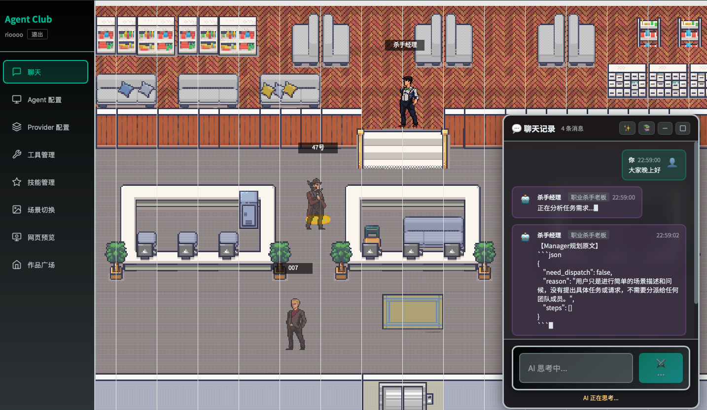

# RPG Multi-Agent System

一个带 RPG 像素场景的多 Agent 协作系统。后端基于 FastAPI 和 AgentScope，前端基于 React、Vite 和 Phaser。当前系统支持普通多 Agent 对话、Manager-Worker 任务分派、会话级产物隔离、HTML 预览和作品广场发布。

> 当前项目仍处于开发阶段，部分 API 和内部结构可能继续调整。

## 当前能力

### RPG 前端

- React UI + Phaser 2D 场景。
- 支持办公室、图书馆等 Tiled 地图。
- 支持角色帧动画配置，当前公共角色资源包括 `boy`、`girl`、`mafia1`、`mafia2`、`mafia3`。
- 浮动聊天窗口展示用户消息、Agent 输出、Manager 过程信息和错误信息。
- 支持 Agent、Provider、Tool、Skill、Scene、HTML 预览、作品广场等页面。

### 多 Agent 模式

系统目前有两种聊天执行模式：

- **MsgHub 模式**：多个普通 `ChatAgent` 参与对话。
- **Manager-Worker 模式**：`ManagerAgent` 负责任务规划、分派、复盘和结果整合，`WorkerAgent` 负责具体执行。

Manager-Worker 当前实际流程：

1. Manager 根据用户请求生成结构化任务计划。
2. 每个步骤包含 `worker_id`、`task`、`input`、`artifact_type`、`output`、`depends_on` 等字段。
3. 系统按依赖执行步骤；同一轮可执行步骤会并发执行。
4. 只有 `completed` 的步骤会解锁下游依赖；失败步骤不会再被当作完成。
5. 依赖失败的步骤会标记为 `skipped`。
6. 如果步骤声明了 `output`，Manager 会尝试用当前工具工作区里的 `read_file` 校验该产物是否可读。
7. 每轮执行后，Manager 会复盘当前结果；如未满足用户请求，可追加补救步骤。
8. 动态复盘有硬限制：最多 3 轮、总步骤最多 10 个、每轮最多追加 3 个步骤。
9. 最后由 Manager 整合所有 Worker 结果返回给用户。

当前 Manager 内部规划原文会通过流式事件显示到聊天框，格式以 `【Manager规划原文】` 开头。

### 用户、会话与产物隔离

配置和运行时的边界如下：

- 用户级配置：Provider、Agent、Manager、Tool、Skill、场景配置。
- 会话级运行时：Agent/Manager/Worker 实例、Agent memory、工具 workspace、场景注入状态。
- 会话级产物：文档、HTML 预览和其他文件产物。

运行时 session 当前按 `(user_id, conversation_id)` 管理。同一用户打开不同会话时，会获得不同的 Agent runtime。单个会话内部通过 `execution_lock` 串行处理聊天请求，避免同一会话内的并发请求同时修改 Agent 状态。

文件产物的实际存储位置为：

```text
output/users/{user_id}/conversations/{conversation_id}/
├── doc/       # 文档类产物
├── preview/   # HTML 预览产物
└── ...        # 其他 output 产物
```

Agent 看到的是逻辑路径，例如：

```text
output/doc/prd.md
output/preview/index.html
output/data/result.json
```

工具层会把这些逻辑路径映射到当前用户、当前会话的实际产物目录。

### HTML 预览与作品广场

- `/api/artifacts` 按当前 `conversation_id` 列出当前会话产物。
- `/preview/{filepath}` 按当前 `conversation_id` 渲染当前会话 HTML 文件。
- 发布作品时，如果使用 `source_file`，必须提供 `conversation_id`。
- 广场发布会把当前会话 preview 文件复制到 `plaza_platform/works/`，发布后的作品不依赖原会话产物继续存在。
- 广场列表和详情支持可选鉴权；前端广场 API 会携带 token，因此后端可以正确返回 `is_mine`。
- 删除作品需要作者本人鉴权。

## 启动方式

### 安装依赖

```bash
# 后端
pip install -r requirements.txt

# 前端
cd rpg-frontend
npm install
cd ..
```

### 开发模式

```bash
# 终端 1：后端 API
python main.py --dev

# 终端 2：前端 Vite
cd rpg-frontend
npm run dev
```

访问：

- 前端：http://localhost:5173
- API 文档：http://localhost:8000/docs

### 生产模式

```bash
python main.py
```

生产模式由后端服务已构建的前端静态文件，访问：

```text
http://localhost:8000
```

## 项目结构

```text
.
├── agents/
│   ├── chat_agent.py          # 普通对话 Agent，内部使用 ReActAgent
│   ├── manager_agent.py       # Manager-Worker 规划、调度、复盘和整合
│   └── __init__.py
├── api/
│   ├── api_server.py          # FastAPI 主应用、聊天流式接口、路由挂载
│   ├── session_manager.py     # user_id + conversation_id 维度的运行时 session
│   ├── conversations_api.py   # 历史会话保存、恢复、删除
│   ├── html_preview_api.py    # 会话级 artifacts、HTML 保存、预览、删除
│   ├── agents_api.py          # Agent 配置
│   ├── providers_api.py       # Provider 配置
│   ├── manager_api.py         # Manager 配置
│   ├── tools_api.py           # Tool 开关配置
│   ├── skills_api.py          # Skill 配置
│   ├── game_config_api.py     # 场景配置
│   └── ...
├── auth/
│   ├── router.py              # /api/auth 登录注册相关接口
│   ├── dependencies.py        # 当前用户鉴权依赖
│   ├── user_data.py           # 用户目录、会话产物目录
│   └── user_managers.py       # 用户级配置管理器和工具注册器工厂
├── config/
│   ├── agents_config.py
│   ├── manager_config.py
│   ├── conversations_manager.py
│   └── ...
├── tools/
│   ├── __init__.py            # ToolRegistry，按用户/会话绑定 workspace
│   └── builtin/               # file_io、file_search、shell、browser 等内置工具
├── skills/
│   ├── skill_registry.py
│   └── examples/              # Markdown 技能定义示例
├── providers/
│   └── ...                    # Provider 管理与模型配置
├── plaza_platform/
│   ├── server.py              # /platform 子应用
│   ├── models.py              # Work 模型
│   ├── database.py            # SQLite 初始化与迁移
│   ├── storage.py             # 发布作品文件存储
│   └── works/                 # 已发布作品 HTML 文件
├── rpg-frontend/
│   ├── src/
│   │   ├── App.tsx            # 主界面、聊天流式事件处理
│   │   ├── api/index.ts       # 前端 API 客户端
│   │   ├── game/ChatScene.ts  # Phaser 场景
│   │   └── pages/             # 配置页、预览页、广场页等
│   └── public/assets/
│       ├── characters/        # 角色精灵图
│       ├── maps/              # Tiled 地图资源
│       └── game-config.json   # 公共角色、动画和场景配置
├── data/users/                # 用户配置和历史会话数据
├── output/users/              # 用户、会话级 Agent 产物
├── main.py                    # 后端启动入口
└── requirements.txt
```

## 主要 API

### 聊天与运行时

| 端点 | 方法 | 说明 |
| --- | --- | --- |
| `/api/chat` | POST | 非流式聊天 |
| `/api/chat/stream` | POST | SSE 流式聊天，需要携带 `conversation_id` 才能绑定会话工作区 |
| `/api/system/reinitialize` | POST | 重建当前用户 runtime，可传 `conversation_id` |
| `/api/health` | GET | 健康检查 |

### 配置

| 端点 | 方法 | 说明 |
| --- | --- | --- |
| `/api/agents-config` | GET/POST/PUT/DELETE | Agent 配置 |
| `/api/providers` | GET/POST/PUT/DELETE | Provider 配置 |
| `/api/manager` | GET/PUT | Manager 配置 |
| `/api/tools` | GET/PUT | 工具开关 |
| `/api/skills` | GET/PUT | 技能配置 |
| `/api/game-config` | GET/PUT | 场景配置 |

### 会话与产物

| 端点 | 方法 | 说明 |
| --- | --- | --- |
| `/api/conversations` | GET/POST | 历史会话列表、保存当前会话 |
| `/api/conversations/{id}` | GET/PUT/DELETE | 会话详情、更新、删除 |
| `/api/conversations/{id}/restore` | POST | 恢复历史会话 |
| `/api/artifacts` | GET | 按 `conversation_id` 列出当前会话产物 |
| `/api/artifacts/{storage}/{filepath}/content` | GET | 读取当前会话产物内容 |
| `/api/artifacts/{storage}/{filepath}` | DELETE | 删除当前会话产物 |
| `/api/html-preview` | GET/POST | HTML 预览文件列表、保存 |
| `/api/html-preview/{filepath}/content` | GET | 读取 HTML 预览内容 |
| `/api/html-preview/{filepath}` | DELETE | 删除 HTML 预览文件 |
| `/preview/{filepath}` | GET | iframe 预览当前会话 HTML |

### 作品广场

| 端点 | 方法 | 说明 |
| --- | --- | --- |
| `/platform/api/publish` | POST | 发布作品，需登录 |
| `/platform/api/works` | GET | 作品列表，支持分页、排序、搜索 |
| `/platform/api/works/{id}` | GET | 作品详情 |
| `/platform/api/works/{id}/render` | GET | 渲染作品 HTML |
| `/platform/api/works/{id}` | DELETE | 删除本人作品 |
| `/platform/api/my-works` | GET | 获取当前用户发布的作品 |

发布当前会话 preview 文件时，请求体需要包含 `conversation_id`：

```json
{
  "title": "我的作品",
  "description": "一个交互页面",
  "tags": "html,agent",
  "source_file": "index.html",
  "conversation_id": "conv_xxx"
}
```

## 流式聊天事件

前端 `App.tsx` 目前按以下事件更新聊天框：

| 事件类型 | 作用 |
| --- | --- |
| `start` / `agent_start` | 创建一条空的 assistant 消息 |
| `chunk` | 向对应 Agent 的消息追加文本 |
| `done` / `agent_done` | 标记该 Agent 消息流式输出结束 |
| `all_done` | 本轮请求完成，恢复 UI 状态 |
| `error` | 新增错误消息 |

Manager-Worker 模式下，后端会把以下内部事件转换成聊天流：

- `manager_thinking`：输出 Manager 规划原文。
- `worker_start`：创建 Worker 消息。
- `worker_done`：输出 Worker 结果并结束 Worker 消息。
- `manager_reviewing`：输出 Manager 正在复盘的提示。
- `plan_updated`：输出 Manager 追加任务的提示。
- `manager_integrating`：创建 Manager 最终回复消息。

## 当前限制

- Manager 已支持复盘追加任务，但仍属于轻量实现；没有持久化 run ledger，也不支持服务重启后从中间步骤恢复。
- Worker 之间没有直接通信，主要通过 Manager 传递摘要和文件引用。
- 产物校验目前只做基础可读性校验，不等同于完整质量评审。
- 用户级配置变更会清理该用户所有运行时 session，因为 Provider、Agent、Tool 等配置当前仍是用户级。
- `rag_relate(no_use)/` 是旧 RAG 相关目录，不属于当前主链路。

## 验证命令

```bash
# 后端语法检查
.venv/bin/python -m py_compile agents/manager_agent.py api/api_server.py api/session_manager.py

# 前端构建
cd rpg-frontend
npm run build
```

## 技术栈

- FastAPI
- AgentScope
- React 18
- Vite
- TypeScript
- Phaser 3
- SQLAlchemy / SQLite
